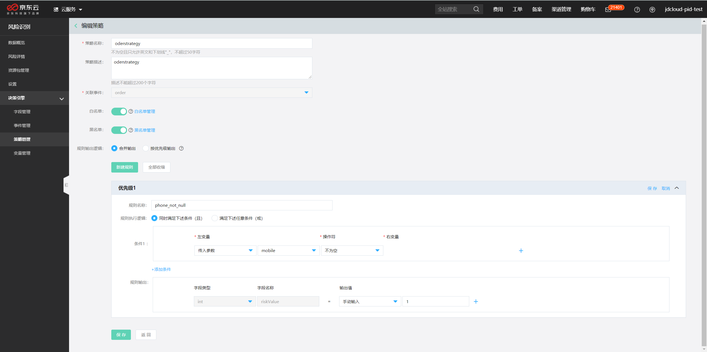
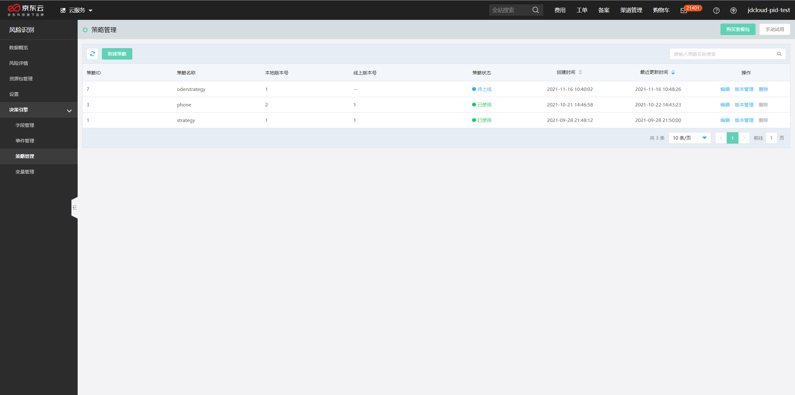

## 策略管理

本文介绍如何在决策引擎中创建策略。

## 背景信息

**策略的含义**：策略是指经过业务编排的运算逻辑。当有事件数据请求时，决策引擎系统会根据您设定的策略进行运算，当策略命中时，系统会输出运行该策略产生的结果。

**使用场景**：在需要进行复杂的逻辑规则判断的情况下，可以通过配置一套组合判断的策略实现。例如，某营销领券场景中，要对已知高风险对象进行风险识别，假设某用户命中手机号码黑名单、IP黑名单及地址黑名单，则判断为高风险，就可以通过配置策略来实现上述判断逻辑。

1. 登录[风险识别控制台](https://bri-console.jdcloud.com/fieldManagement)。

2. 在左侧导航栏，选择**决策引擎** > **策略管理**。

3. 在**策略管理**页面，单击**新建策略**。

4. 配置新建策略的参数。

   （1）配置策略基础信息。

   输入**策略名称**和**策略描述**，选择**关联事件**。

   **注意**：因事件入参、自定义变量与事件的字段有关联关系，为了防止误操作导致变量不可用而影响策略运算，关联事件选中并提交后不支持修改。

   （2）开启黑白名单

   黑白名单默认关闭，当开启后，事件入参匹配到黑名单，默认输出该事件为高风险。当事件入参匹配到白名单时，默认输出该事件为无风险。

   （3）配置策略计算逻辑。

   您可以根据以下说明输入条件名称并配置变量信息：

   **规则名称：**为方便可视化预览时直观展示策略逻辑，建议输入易于理解的内容。

   **左变量**：左边量可以选择传入参数（事件字段）、自定义变量。

   **操作符**：选择所需的操作符，对左变量进行判断。系统会根据左变量的类型，匹配可选的操作符。例如，左变量为string类型时，大于、小于操作符不可用。

   **右变量**：当左变量及操作符选中后，右边量支持传入参数、自定义变量、手动输入。

   **注意**：需要单独保存每一条规则，再保存策略，否则无法保存策略。

   

   （4）配置规则输出。

​              规则输出默认字段类型为int类型，字段名称为riskValue，输出值为手动输入。

​              策略命中后输出是指设定的策略条件在满足的情况下，决策引擎系统返回的内容。策略命中后输出支持标签、评分、自定义变量。

​       **策略输出标签**：可以使用易于理解的内容，例如highrisk,pass等。当一个事件下多个策略都配置了同样的标签时，系统最终会去重输出。

​      **策略输出评分**：评分值为整数，取值范围为-100到100。策略命中后策略评分参与事件分值计算，事件分值是此事件下所有命中策略的评分之和。

​      **输出变量**：除评分和标签外，还可以自定义输出变量，如：事件的入参、中间变量等。当策略命中时，自定义的输出变量会在返回报文中输出。

单击**保存**。

成功后，会跳转到策略列表页面。

