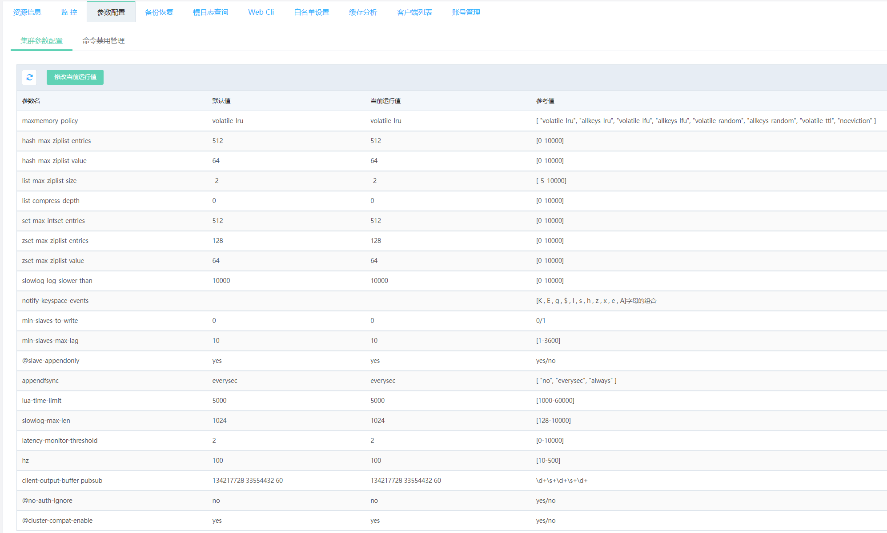

# 参数配置

该功能可帮助用户对当前Redis实例的参数进行配置调优。

##  操作步骤

1.登录[Redis 控制台](https://redis-console.jdcloud.com/redis)。

2.在"实例列表"页面，选择目标实例，点击 实例名称，进入"实例详情"页面。在"实例详情"页面，点击 参数配置 tab签页面，进入"集群参数配置"页面。

3. 点击修改当前运行值操作后当前运行值列变为可输入，在输入完后点击保存既完成修改。

| 参数名称  |  参数说明  | 默认值	  |  参数范围  |  
| :--- | :---  |:---  |:---  | 
|  maxmemory-policy	 | 达到最大内存使用率时数据的移除策略		  |  	 volatile-lru | 请参考后文。注意4.0版比2.8版本多allkeys-lfu,volatile-random  | 
|  hash-max-ziplist-entries	|  当hash的key的数量不大于指定值时，使用特殊存储(ZIPLIST)来节省空间  |	512		  |  0-10000	  |  
|  hash-max-ziplist-value	|  当FIELD和VALUE的长度不大于指定值时，使用特殊存储(ZIPLIST)来节省存储空间  |	64	  |  	0-10000	  |  
|  list-max-ziplist-entries(2.8版)	|  当列表的数据不大于指定值时，使用特殊编码（ziplist）来捷顺存储空间  |	512	  |  	0-10000	  |  
|  list-max-ziplist-value(2.8版)	|  当value的长度不大于指定值时，使用特殊编码（ziplist)来节省存储空间  |	64		  |  0-10000	  |  
|  list-max-ziplist-size(4.0版)	|  用ziplist编码实现的列表对象，按照数据项个数或占用的字节数，限定ziplist的长度  |	-2		  |  -5-10000	  |  
|  list-compress-depth(4.0版)	|  用ziplist编码实现的列表对象，quicklist两端不被压缩的节点个数  |	0	  |  0-10000	  |  
|  set-max-intset-entries	|  当set数量不大于指定值时，使用特殊编码（intset）来节省存储空间  |	512		  |  0-10000	  |  
|  zset-max-ziplist-entries	|  当zset元素数量不大于指定值时，使用特殊编码（ziplist）来节省存储空间  |	128		  |  0-10000	  |  
|  zset-max-ziplist-value	|  当元素值得最大长度不大于指定值时，使用特殊编码（ziplist）来节省存储空间  |	64		  |  0-10000	  |  
|  slowlog-log-slower-than	|  慢日志功能记录命令的最大执行时间，单位：微秒  |	10000		  |  0-10000	  |  
|  notify-keyspace-events |  定义了服务器将发送哪些类型的通知   |	 		  | [K , E , g , $ , l , s , h , z , x , e , A]字母的组合 |  
| min-slaves-to-write | 当主节点有效的从节点个数小于这个值时拒绝写入   |  0   | 	0/1  | 
| min-slaves-max-lag |有效从节点的延时必须小于这个值，单位秒  | 10  | 1-3600  | 
| @slave-appendonly |  开启从持久化  | no  | yes/no | 
| appendfsync | aof文件调用fsync强制落盘的策略    | everysec  | no/everysec/always  | 
| lua-time-limit |  lua脚本的最长执行时间（毫秒）, 当超过这个时间时,可通过执行script kill杀死正在执行的Lua脚本，设置为0表示没有时间限制  | 5000 | 1000-60000  | 
| slowlog-max-len | 最多记录最近多少条慢日志。慢日志记录会消耗内存   | 1024 | 128-10000  | 
| latency-monitor-threshold | 延时监控的采集阀值。为0表示禁用延时监控采集  | 2  | 0-10000  | 
| hz | 设置Redis后台任务执行频率，例如清除过期键任务。取值范围为1~500，默认值为100，即每秒执行100次   |100  |10-500  | 
| client-output-buffer pubsub | 订阅客户端输出缓冲区大小  | 134217728 33554432 60  | \d+\s+\d+\s+\d+   | 
| @no-auth-ignore |  实例没有密码时，即使客户端发送了密码，也返回OK | no  | yes/no  | 
| @cluster-compat-enable | 主从版是否兼容cluster语法，集群版没有效果  | yes  |yes/no  | 
| timeout |当客户端连接闲置时间达到该指定值时，将关闭连接，单位为秒（s），为0表示不开启 | 300  | 0~100000  | 

####     notify-keyspace-events参数说明
| 字符  |  参数说明  | 
| :--- | :---  |
| K  |  键空间通知，所有通知以__keyspace@<db>__为前缀  |
| E  |  键事件通知，所有通知以__keyevent@<db>__为前缀  |
| g  |  DEL、EXPIRE、RENAME 等类型无关的通用命令的通知  |
| $  |  字符串命令的通知  |
| l  |  列表命令的通知  |
| s  |  集合命令的通知  |
| h  |  哈希命令的通知  |
| z  |  有序集合命令的通知  |
| x  |  过期事件，每当有过期键被删除时发送  |
| e  |  驱逐（evict）事件，每当有键因为 maxmemory 策略而被删除时发送  |
| A  |  参数 g$lshzxe 的别名  |

####    驱逐策略maxmemory-policy参数说明
| 参数名称  |  参数说明  | 
| :--- | :---  |
|  volatile-lru  |  只对设置了过期时间的key进行LRU（默认值）。  |  
|  volatile-random  |  只限于设置了expire的部分，删除一部分expire的key。  |  
|  volatile-ttl  |  只限于设置了expire的部分，优先删除剩余时间(time to live,TTL)短的key。  |  
|  allkeys-lru  |  优先删除最近最少使用的(less recently used,LRU)key。  |  
|  allkeys-lfu  |  在所有的key中使用LFU算法淘汰数据 。 |  
|  allkeys-random  |  随机删除一部分key。  |  
|  noeviction  |  不删除策略，达到最大内存限制时，如果需要更多内存，直接返回错误信息。  |  
| volatile-lfu | 只对设置了过期时间的key使用LFU算法淘汰数据。  |  

