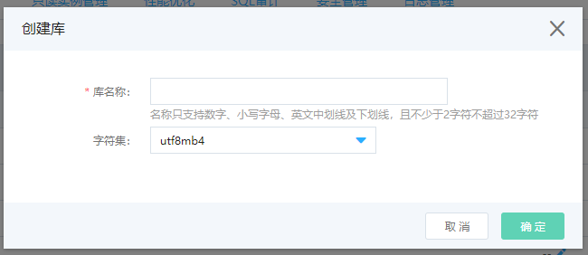

# 创建库
本文介绍如何为RDS实例创建数据库。

## 使用限制

* 同一数据库实例的数据库名称不可重复
* 创建数据库时不可使用保留字段，保留字段参见 [限制说明](https://docs.jdcloud.com/cn/rds/mysql-restrictions)
* 出于性能考虑，SQL Server每个实例允许创建的最大数据库数量为 **50** 个

## MySQL/Pecona/MariaDB 创建库

1. 登录[云数据库 RDS管理控制台](https://rds-console.jdcloud.com/database)。
2. 点击目标实例，进入实例详情页，切换至 **库管理** Tab页。
3. 点击 **创建库** 按钮，创建库弹窗框参数说明如下：
|参数名称|说明|
|--|--|
|数据库名称|&bull;2-32位字符  &bull;支持小写字母、数字以及英文划线及下划线  &bull;数据库名称在实例中唯一  &bull;不可使用保留字，参见 [限制说明](https://docs.jdcloud.com/cn/rds/mysql-restrictions)|
|字符集|可选择utf8, gbk, latin1, utf8mb4, euckr, armscii8, ascii, big5。|

4. 单击 **确定** 按钮，完成库的创建，返回库管理的列表页。

## SQL Server 创建库

1. 登录[云数据库 RDS管理控制台](https://rds-console.jdcloud.com/database)。
2. 点击目标实例，进入实例详情页，切换至 **库管理** Tab 页，点击 **创建库** 按钮，创建库弹窗框参数说明如下：
3. 
|参数名称|说明|
|--|--|
|数据库名称|&bull;2-100位字符  &bull;支持大小写字母、数字以及英文下划线  &bull;必须以字母开头  &bull;数据库名称在实例中唯一  &bull;不可使用保留字，参见 [限制说明](https://docs.jdcloud.com/cn/rds/sqlserver-restrictions)|
|字符集|可选择 Chinese_PRC_CI_AS、Chinese_PRC_CS_AS、 SQL_Latin1_General_CP1_CI_AS、 SQL_Latin1_General_CP1_CS_AS、 Chinese_PRC_BIN。|
|授权账号|从可授权账号中选中需要授权库访问权限的账号，点击 **>** 按钮，账号会添加至已授权账号列表，默认账号对库的访问权限是 **只读**，支持修改为 **读写**|

4. 单击 **确定** 按钮，完成库的创建，返回库管理的列表页。